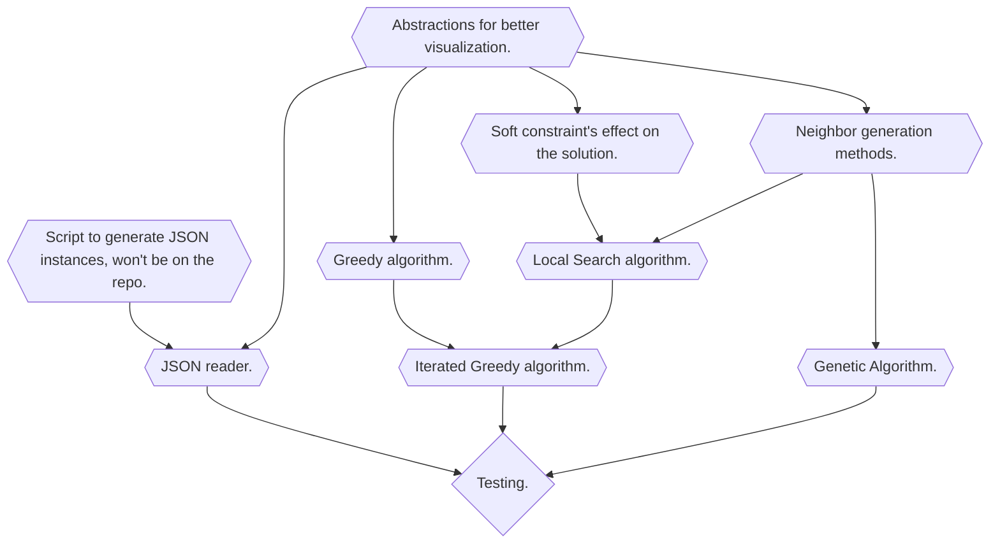

# seminario3_inf284
This repository contains the codebase for a metaheuristics project aimed at solving the market partitioning problem in machines. It explores optimization techniques to effectively divide markets among available machines.

## To do graph:


## Setup:
After cloning the repository, go to the repository directory. Write the commands ```mkdir build && cd build && cmake ..```. If everything works correctly, you can compile it with ```make -j4``` (the number should be number of cores in your computer).
If you need help in the execution, run ```./sem3 -h```.

### ⚠️ Unexpected but Valid Result

For some large test cases with highly dispersed values (for example, `8e9c`, which contains over 3,000 numbers with a very high input standard deviation), the **Iterated Greedy** algorithm produced a much lower standard deviation than the Greedy heuristic:

| Instance | Greedy | Iterated Greedy |
|----------|--------|------------------|
| 8e9c     | ~196,373,704 | ~0.49 |

This sharp drop is **not a bug**. When the input includes a few extremely large numbers and many much smaller ones, the greedy approach tends to isolate large elements and distribute smaller ones locally. This can trap the solution in a poor local minimum. The IG algorithm partially destroys and reconstructs the solution, allowing smaller elements to be reassigned in a way that better balances the outliers.  

So the unusual result for `8e9c` simply shows that the IG found a valid, much better partition that the Greedy method could not reach.
