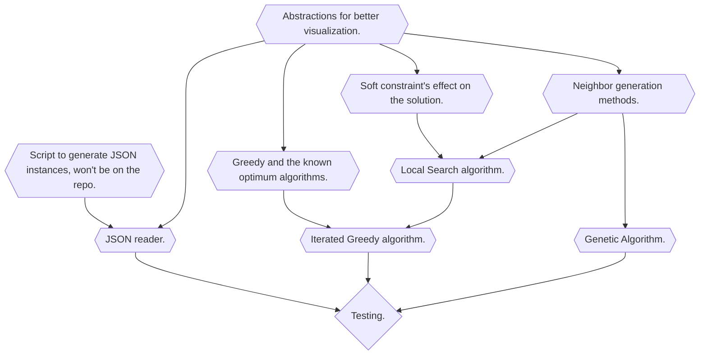

# seminario3_inf284
This repository contains the codebase for a metaheuristics project aimed at solving the market partitioning problem in machines. It explores optimization techniques to effectively divide markets among available machines.

